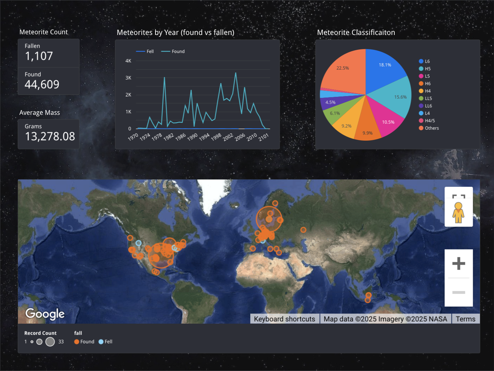

# Meteorite Data Pipeline with Dashboard \
*Data Engineer Zoomcamp 2025 - Capstone Project*

## Purpose of this project:
The purpose of this project is to ingest meteorite data collected by the Meteoritical Society and present statistical and location information in a easy-to-interpret dashboard. There are several pyspark notebooks which utilize this data on Kaggle to interpret various insights, but I wanted to add a visual map to highlight the hotspots of meteorite discovery using looker studio.

## Dataset used in this project:
Dataset: https://catalog.data.gov/dataset/meteorite-landings \
Download: https://data.nasa.gov/api/views/gh4g-9sfh/rows.csv?accessType=DOWNLOAD

## Project Description:
### Technologies Used
* **Cloud Technologies:** Google Cloud Storage, Google Big Query, Google Looker Studio
* **Infrastructure as Code:** Kestra is used to provision and destroy resources required to run the project
* **Data Warehouse:** Data is stored in Google BigQuery using clustered tables.  Partitioning was not feasible based on the lack of complete timestamps, however this was overcome by clustering on the 'year' column. Additional cluster fields include 'fall' and 'recclass' for improving efficiency for queries used in the dashboard based on status and classification of the object. 
* **Data Ingestion:** Kestra is used to orchestrate the environment and data pipeline. This project extracts a csv file directly from the dataset provider directly to load into Google Big Query in addition to uploading a copy into a Google Cloud Storage bucket. Streaming is not included due to the way the data is published.
* **Dashboard:** A Google Looker dashboard is included which provides insights on the number of found or fallen objects, the average mass of all objects, a geographic cluster map, a pie line chart showing trends over time for found and fallen objects, as well as a pie chart showing the breakdown of composition for objects discovered.

## Running This Project:
1. 
